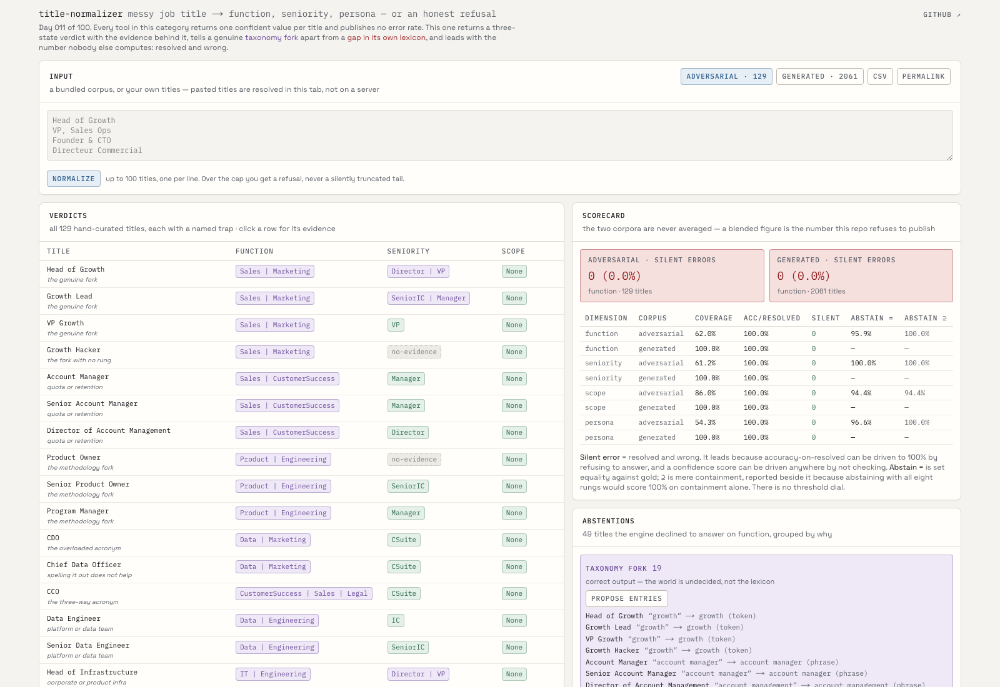
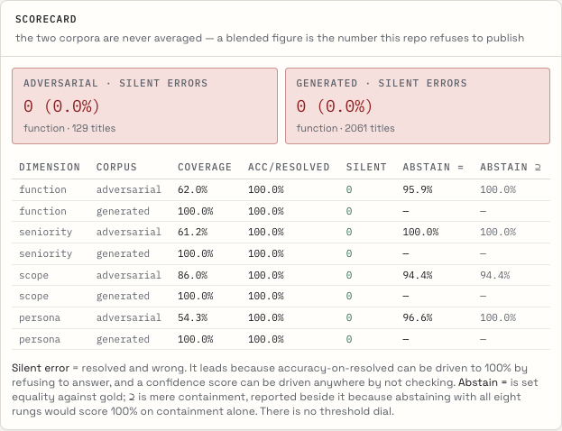
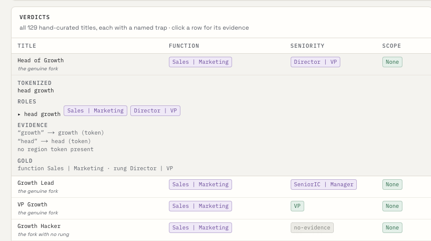
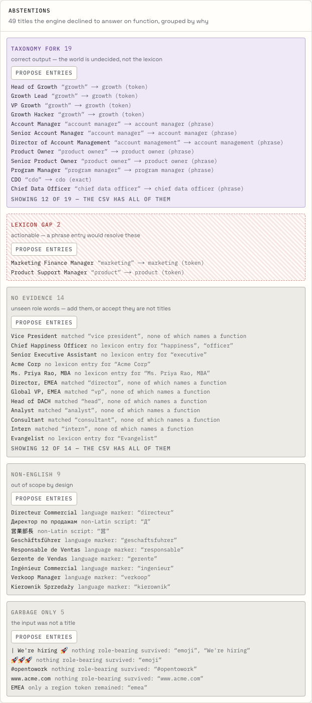
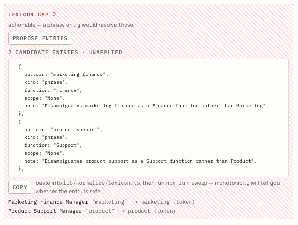

# Title Normalizer

**Messy job titles → function, seniority, scope and persona — or an honest refusal.**

Live: **https://title-normalizer.vercel.app** · Day 011 of a 100-day building challenge

Every GTM stack normalizes job titles. Clay, Apollo, ZoomInfo, the enrichment vendor your company
pays, the `CASE WHEN title ILIKE '%vp%'` block in your warehouse — all of them take a string and
return a function and a seniority, with total confidence and no error bar. Ask any of them how often
that answer is wrong and there is no number, because none is computed.

This one computes it, and leads with the bad half.

```
                        adversarial (129)        generated (2,061)
  silent error rate     0  (0.0%)                0  (0.0%)      ← resolved and wrong
  coverage              62.0%                    100.0%         ← share it answered at all
  accuracy on resolved  100.0%                   100.0%
  abstention precision  95.9% exact / 100% ⊇     —              ← was the ambiguity real?
```

Those are function-dimension figures for both corpora, generated by `npm run sweep`, never typed by
hand. The full four-dimension table is further down, and the two corpora are never averaged into one
number.

---

## The part everybody gets wrong

The received explanation for why title normalization is hard is that titles are *messy*: casing,
punctuation, abbreviations, `| We're hiring 🚀` glued onto the end. That part is real, and it is the
easy part. String problems have solutions.

The actual difficulty is that **the taxonomy is underdetermined.**

- `Head of Growth` is Marketing at one company and Sales at the next, and at a third it is a team of
  two doing both. There is no fact of the matter.
- `Head of Sales` is a Director at 80 headcount and a VP at 2,000. Same string, different rung, and
  the string does not carry headcount.
- `Product Owner` is a Product title in a company that runs Scrum and a delivery role inside
  Engineering in a company that says Scrum and means Gantt.
- `Chief of Staff` has no function at all.

Every tool in the category resolves these by silently picking one branch. The pick is invisible,
undocumented and consistent enough to look correct — and then it propagates: it routes the lead,
scores the account, selects the sequence, and lands in the board deck as *pipeline by persona*.

This repo picks none of them, and says which kind of "don't know" it is.

## Three states, and two kinds of ambiguity

Every dimension of every role returns one of three things, always with the evidence that produced it:

| state | means |
|---|---|
| `resolved` | one value, plus the phrase or token that decided it |
| `ambiguous` | the full candidate set, plus a **reason** |
| `unknown` | no answer, plus a **reason** |

The reason is the interesting part, because two of them are opposites:

- **`taxonomy-fork`** — the lexicon *declares* this ambiguity with a multi-value entry. The world is
  undecided. The output is correct and **nobody has work to do.**
- **`lexicon-gap`** — two token entries disagreed and no phrase covered them. The ambiguity is in
  *our file*. **Somebody has to write a phrase.**

Every other tool ships these as the same undifferentiated "low confidence" bucket. Telling them
apart is this repo's central claim, and the console draws them in different colours with different
border styles so you can see the difference in a greyscale screenshot.

Three more reasons cover the rest: `no-evidence` (nothing matched), `non-english` (out of scope by
design — `Directeur Commercial` gets a loud refusal, not a guess), and `garbage-only` (the input was
not a title).

## No confidence scores

There is no `0.62` anywhere in this repo, and no threshold dial to trade coverage against precision.

A float tells you nothing you can act on: not *which* other function was in contention, not why, not
whether the contention was real. It exists so the column is not empty. A candidate set plus the
tokens that forced the fork is auditable, and a downstream router can actually branch on it.

A dial is worse: it lets a reader tune the demo to whatever number flatters it. The four figures
below are published at one operating point.



## The numbers

```
scorecard — the two corpora are never averaged
  dimension corpus         coverage  acc/resolved  SILENT ERR  abstain=  abstain⊇
  function  adversarial       62.0%        100.0%    0 (0.0%)     95.9%    100.0%
  function  generated        100.0%        100.0%    0 (0.0%)         —         —
  seniority adversarial       61.2%        100.0%    0 (0.0%)    100.0%    100.0%
  seniority generated        100.0%        100.0%    0 (0.0%)         —         —
  scope     adversarial       86.0%        100.0%    0 (0.0%)     94.4%     94.4%
  scope     generated        100.0%        100.0%    0 (0.0%)         —         —
  persona   adversarial       54.3%        100.0%    0 (0.0%)     96.6%    100.0%
  persona   generated        100.0%        100.0%    0 (0.0%)         —         —

abstentions by reason
  adversarial  taxonomy-fork 74  lexicon-gap 4  no-evidence 42  non-english 36  garbage-only 20
```

**Silent error rate** is resolved *and* wrong, over all titles. It leads because
accuracy-on-resolved can be driven to 100% by refusing to answer, and a confidence histogram can be
driven anywhere by not checking.

**Abstention precision** is scored two ways. `=` is set equality: the engine said
`{Director, VP}` and gold said `{Director, VP}`. `⊇` is mere containment, reported *beside* equality
and never alone — abstaining with all eight rungs would score 100% on containment.

Read coverage and silent errors together. 62% coverage on the adversarial corpus is not a failure:
that corpus is 129 titles chosen to break normalizers, and 74 of its abstentions are declared forks
where refusing **is** the right answer. The honest summary is *it answered 62% of the hardest titles
in the domain and got none of them wrong.*

The generated corpus measures something different and easier — robustness to noise — and the lexicon
was fixed until it passed. That is exactly why it is reported in its own column and never averaged
with the other.



## Every verdict shows its work

Click any row and you get the token stream the engine reasoned over, the roles it split the title
into, the phrases and tokens behind each verdict, and the gold label it was scored against.



## The named traps

The adversarial corpus is 129 hand-curated titles, each carrying a gold label and a named trap. One
test per trap, named after the trap, so a failure reads as *"the phrase that beats its tokens"*
rather than as an index into a fixture.

| trap | title | correct behaviour |
|---|---|---|
| the genuine fork | `Head of Growth` | `ambiguous {Sales, Marketing}` · `taxonomy-fork` |
| the ladder interval | `Head of Sales` | seniority `[Director, VP]` — and the *band* still resolves to Leader |
| the phrase that beats its tokens | `Sales Engineer` | `Sales`, not Engineering |
| the ops trap | `VP of Sales Operations` | `RevOps`; `People Operations` → HR; `Security Operations` → Security |
| the compound | `Founder & CTO` | **two resolved roles**, not one ambiguity |
| the functionless exec | `Chief of Staff` | `ExecGeneral`, resolved, over a three-rung straddle |
| the residual function | `Managing Director, Sales` | `Sales` — a concrete function outranks `ExecGeneral` |
| the British `executive` | `Account Executive` | an IC, not an exec |
| the methodology fork | `Product Owner` | `ambiguous {Product, Engineering}` |
| the region suffix | `Director, EMEA` | scope `Regional`, function `unknown (no-evidence)` |
| global and regional at once | `Global VP, EMEA` | scope abstains rather than applying a precedence rule nobody agreed to |
| the junk-only string | `\| We're hiring 🚀` | `unknown (garbage-only)` |
| the foreign title | `Directeur Commercial` | `unknown (non-english)` |
| the English title that looks foreign | `Commercial Director` | `Sales`, resolved |

## Abstentions are grouped by what you would do about them



Two lexicon gaps are left in the corpus deliberately — `Marketing Finance Manager` and
`Product Support Manager`. A corpus tuned until the engine passes it measures nothing, so they stay,
and they cost real coverage in the table above.

## The model's one job

`GEMINI_API_KEY` buys exactly one thing: reading the titles the engine already refused and proposing
candidate lexicon entries. They land as a **copyable diff that is never written to disk.**



The model never normalizes a title, never resolves an ambiguity, never picks a branch of a fork and
never appears in a measured number. If it did, every figure above would become a claim about a
sampled distribution of model outputs rather than a property of a file you can read.

With the key unset, everything else works: both corpora, every verdict, the whole scorecard, the
grouping, the CSV, the permalink and `POST /api/normalize`.

## The six invariants

`npm run sweep` brute-forces six properties over both corpora and prints the numbers this README
quotes.

```
  determinism            2190 titles, byte-identical on re-run
  idempotence            2173 titles, function/rung/band are a fixed point of the token stream
  noise invariance       2061 variants across 10 ops preserve function and rung
  lexicon monotonicity   220 entries withheld in turn, 1,451,799 verdict comparisons
  taxonomy               220 entries, 60 persona cells, 58 named / 2 pruned
  ladder contiguity      59 ambiguous rungs, every one a contiguous interval
```

**Lexicon monotonicity** is the one that earns its runtime. It withholds each of the 220 entries in
turn, re-answers both corpora, and asserts three things: no entry *suppresses* an answer, no entry
*widens* an ambiguity, and no entry *flips* a resolved function except by being more specific than
the evidence it displaced. That last clause is what forbids the accident — two entries of equal
specificity fighting over one title, resolved by file position. Seniority is exempt from it for a
stated reason: rungs aggregate by ceiling, so adding `senior` is *supposed* to move `Senior Account
Executive` up a rung.

**Noise invariance** is what keeps the generated corpus honest. Ten label-preserving ops — case
mangle, punctuation swap, separator variants, abbreviation expand/contract, appended junk,
parenthetical department, department prefix, region suffix, whitespace slip, credential suffix — and
one hard rule: *if an op could change the function or the rung, it is not a noise op.* It becomes a
hand-curated adversarial case instead. Two bugs were caught by that rule during the build (an
abbreviation op expanding the `IT` inside `SECURITY`, and a junk op burying a function word in a
tagline).

## Try it on your own data

Paste up to 100 of your own titles into the console. They are resolved **in your browser** — the
engine is a pure function, so there is no round trip and nothing is logged. The scorecard switches to
coverage-only and greys out accuracy rather than inventing a denominator you do not have.

Or skip the UI:

```bash
curl -sX POST https://title-normalizer.vercel.app/api/normalize \
  -H 'content-type: application/json' \
  -d '{"titles":["Head of Growth","VP, Sales Ops","Founder & CTO","Directeur Commercial"]}'
```

```json
{"results":[{"raw":"Head of Growth","function":{"state":"ambiguous",
  "candidates":["Sales","Marketing"],"reason":"taxonomy-fork",
  "because":["“growth” → growth (token)"]}, ...}]}
```

Over the cap you get a `400` naming the cap, never the first 100 titles with the rest silently
dropped. Same for the permalink.

## Architecture

```
                    ┌─ server component ──► data/*.ts (Zod-validated at import)
Browser ────────────┤
                    ├─ lib/normalize (pure) ──► same functions client- and server-side
                    │
                    ├─ POST /api/normalize ──► rate limit ──► same pure engine ──► Zod
                    │
                    └─ POST /api/propose  ──► key check ──► rate limit ──► model ──► Zod
                                                              ──► LexiconEntry[] (unapplied)
```

`lib/normalize/` imports `zod` and nothing else. Not `next`, not `react`, not `@google/genai`, no DOM
globals, no `Date.now`, no `Math.random`. An eslint rule enforces it and `purity.test.ts` re-checks
it by reading the engine's own source off disk with no allowlist at all. This is not stylistic: a
normalizer that cannot reach a network client cannot return an answer that is not a consequence of
its arguments and its lexicon, which is what makes the published numbers mean anything.

### The pipeline

```
raw title
 ├─ 1. SCRIPT     non-Latin / language marker  ──► unknown (non-english)   stop
 ├─ 2. TOKENIZE   junk, credentials, regions;
 │                nothing role-bearing left    ──► unknown (garbage-only)  stop
 ├─ 3. SEGMENT    split on conjunctions → 1..n role segments
 ├─ 4. MATCH      exact ▸ longest phrase ▸ token
 ├─ 5. RESOLVE    per segment, per dimension
 ├─ 6. PRIMARY    highest rung wins, ties leftward
 └─ 7. DERIVE     band ← seniority, persona ← (function, band)
```

One rule governs step 5: **the most specific claim wins, and a disagreement between claims of equal
specificity is reported rather than resolved.**

### The taxonomy

15 functions · 8 ordered rungs · 3 scopes · 4 bands · 58 personas (2 cells pruned as impossible).

Seniority is *ordered*, which is worth exploiting: an honest uncertainty about a rung is always a
**contiguous interval**, so `Head of Sales` stores as `[Director, VP]` rather than as an arbitrary
set, and contiguity is a sweep invariant. It also means an abstention does not have to spread —
Director and VP are both the Leader band, so the *band* resolves even though the rung did not.

Persona is derived from (function, band) and has no resolution path of its own. That makes the state
every CRM eventually holds — `function = Marketing`, `seniority = VP`, `persona = Technical IC` —
unrepresentable.

### The lexicon is the documentation

220 entries in three kinds: `exact` (whole segment only — `ceo`, `owner`, `president`), `phrase`
(beats any token inside it), `token` (the fallback). Every phrase and exact entry carries a `note`
saying why it exists, and the schema refuses to load one that does not:

```ts
{
  pattern: "sales engineer",
  kind: "phrase",
  seniority: "IC",
  function: "Sales",
  note: "presales: the phrase exists precisely so the `engineer` token cannot claim it for Engineering",
},
{
  pattern: "growth",
  kind: "token",
  function: ["Sales", "Marketing"],
  note: "the flagship declared fork: Head of Growth is Marketing at one company, Sales at the next",
},
```

## Commands

```bash
npm install
npm run dev          # dev server
npm run build        # production build
npm test             # vitest — 140 tests
npm run sweep        # six invariants + the README numbers
npm run generate     # regenerate the seeded corpus (committed output)
npm run typecheck    # next typegen && tsc --noEmit
npm run lint         # includes the engine boundary rule

npx vitest run -t "the phrase that beats its tokens"   # one trap by name
```

Stack: Next 16 (App Router) · React 19 · TypeScript `strict` + `noUncheckedIndexedAccess` ·
Tailwind 4 · Zod 4 · Vitest 4 · `gemini-3.6-flash` at one seam · Vercel.

## Reproducibility

Both corpora are committed. The generated one comes from a seeded PRNG (`SEED = 11011`) over 144
hand-labelled canonical roles, and nothing in the engine or the generator reads a clock or an
unseeded random source. Gold labels are written by hand next to each role — never produced by running
the engine over the canonical form, which would promote any systematic bug to ground truth and then
score it as correct.

Clone it and run `npm run sweep`. You get the numbers in this file, with no credentials.

## What this repo is not

Sibling days own the neighbours and this one does not rebuild them: Day 004
[`persona-mapper`](https://github.com/akshatiwarix/persona-mapper) maps company → buying committee
and *emits* titles (this is the inverse map); Day 003
[`lead-cleaner`](https://github.com/akshatiwarix/lead-cleaner) owns record hygiene; Day 009
[`lead-router`](https://github.com/akshatiwarix/lead-router) *consumes* normalized titles to route;
Day 010 [`crm-doctor`](https://github.com/akshatiwarix/crm-doctor) audits a whole CRM's fields.

Also out of scope, deliberately: non-English lexicons, headcount-conditioned seniority (the
`[Director, VP]` interval would collapse if you knew company size — but the input contract is a
string), confidence scores, an ML classifier, embeddings, and persisting anything you paste.

A plain-English walkthrough with no code is in [docs/plain-english-guide.md](docs/plain-english-guide.md).

## License

MIT
